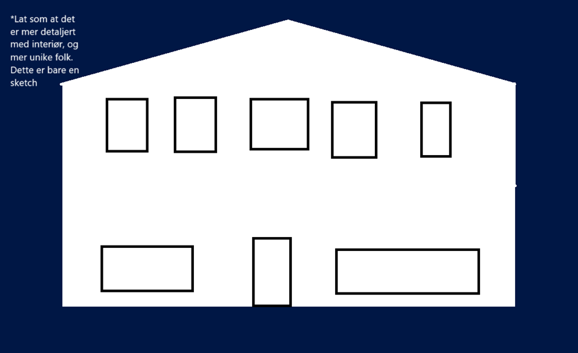
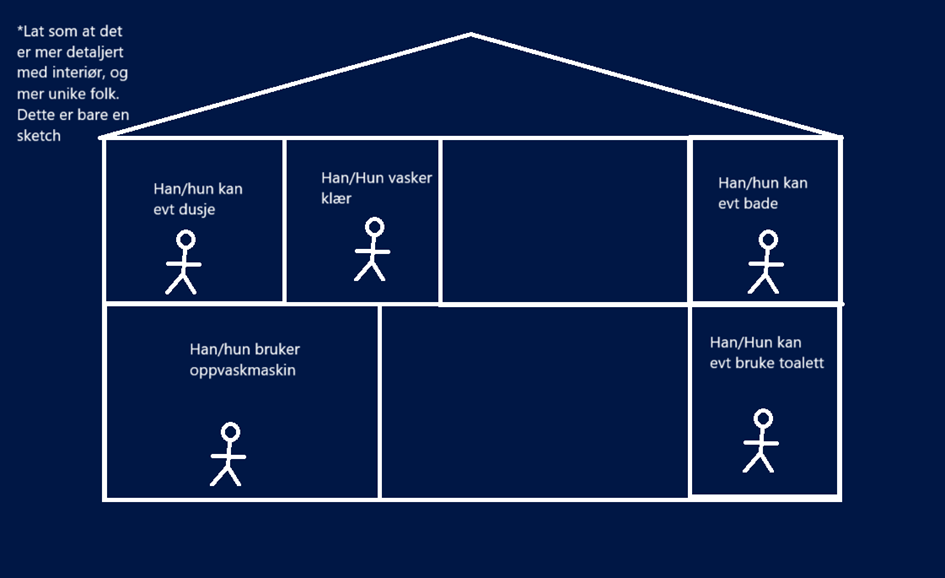
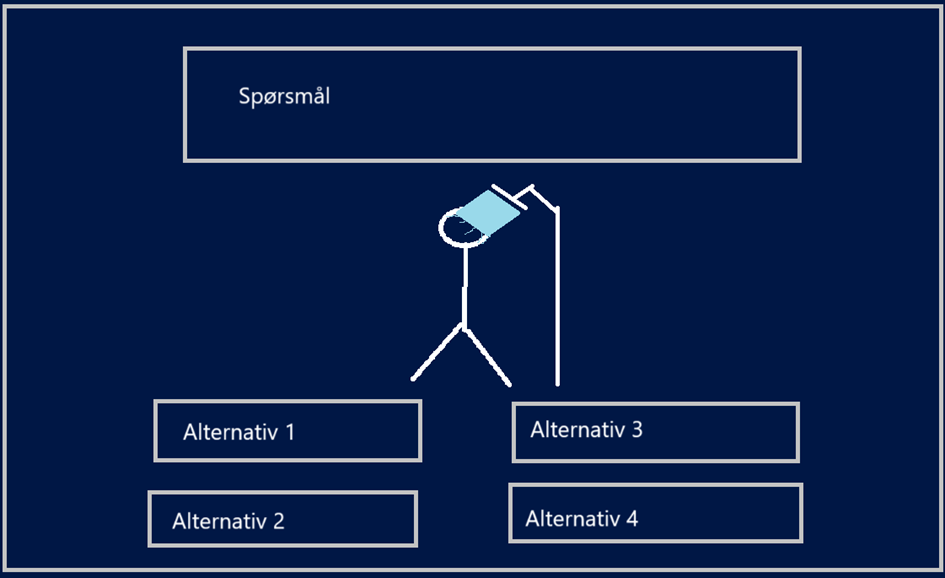

## Project overview and purpose
The purpose of this project was to tackle sustainable development goals as a scrolly story to guide users through a narrative and convey a message related to it.   SDG goal 6 and SDG goal 12 where the specific goals we took into account. Clean Water And Sanitation, and Responsible Consumption And Production. 

The purpose of the story is to showcase overuse of water and by user interaction comparing how much water they think regular activities like flushing a toilet and taking a shower actually use. By comparing them up towards a character that actively overuses water doing the same activities to put into perspective how much clean water is actually used.
## Points during brainstorming session
The main thing we wanted to achieve with this project was to either subvert expectations or put into perspective ones own biases and expectations related to the SDG goals. 

We went back and forth on the exact goal we wanted to tackle, we considered take into consideration goal 4, 1 and 10 by making a story showing how a normal student through university makes below the poverty line in terms of income especially if they have no other income than a summer job or weekend job. But found this difficult to implement in terms of an actual story.

Another idea was to tackle the idea of a certain animal in an ecosystem one that we consider annoying or don't see the impact of as humans like seagulls for example and removing them entirely. 

Showing to characters debating the great changes to being able to go to the beach not getting bird poop on your car and eating ice cream and bread by the beach without worries. 

The way we would subvert is using this "utopian" worldview and show how they would imagine it then later showing the actual realities what would happen removing a vital animal from an ecosystem but we struggled to come with ideas for interactivity and it would be more of just as an aha to the user which might weaken the actual messaging of the vital importance of species in their various environments This would vary somewhere from goal 13 - 15. 
## Storyboard
First you see a house with a smooth transition into the house

The idea was to zoom into different rooms showing people (Later just the Alex character)

Then showcasing the person using the shower or bath etc and the questions of the usage related to it under

[Person bathing](Readme/Images/bath-storyboard.png)
## Stack used
We didn't use any specific stack for the implementation of the project the only exception is the code and idea for the scrolling animation effect using the intersection observer API we have utilized the idea came from a Medium Article ***How to Implement Animation On Scroll with Vanilla JavaScript*** https://javascript.plainenglish.io/how-to-implement-animation-on-scroll-with-vanilla-javascript-655093a38059 
### Use of Animations Interactions and Observers
There are 3 separate observers for the website 
The first is the main observer used in the section tags that triggers once they intersect with about 30% of the container they remove the pre added class of hide with show triggering a transition animation adding opacity.

The second use of observer is to animate the house after the original hero section of the page to give the zoom effect into the house by just zooming into the SVG after it comes into view

The third is the use of the filling water tank to display the characters usage of water throughout the different quiz questions. Then later hiding it again after you get to the end of the quiz / story. Then we added a spil animation to tip the water tank, a script that removes the item from veiwport.

In terms of interactions the main interactive part of the site is the quiz that askes how much different activities use in terms of liters of water. By grabbing the numbers directly from the buttons and comparing them to the quiz object inside the script to validate the users answers and log the result later in the script and depending of the result of that scaling up or down the different tanks to visualize the difference.

Another was the updateWaterTank function, after each use of the quiz function a position sticky watertank gets filled more and more after every quiz answer to later overflow and transition to the end of the story and the results part of the page. 

SVG elements that were not made by us, were taken from https://www.svgrepo.com/

link to github pages: https://idg1293-2025.github.io/oblig3-group-8/